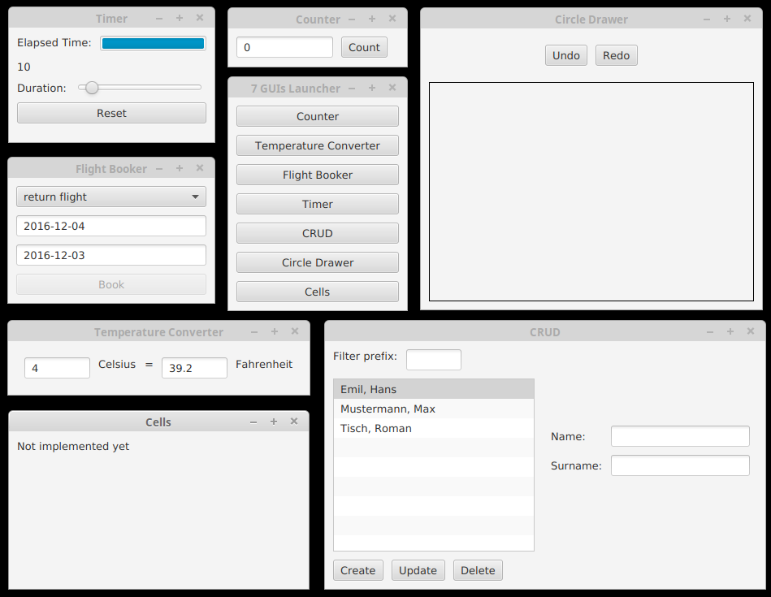

# 7guis-tornadofx
Kotlin implementaion of [github/eugenkiss/7guis/wiki](https://github.com/eugenkiss/7guis/wiki)

Most of the guis are updated versions of [github/eugenkiss/kotlinfx](https://github.com/eugenkiss/kotlinfx/tree/master/kotlinfx-demos/src/main/kotlin/sevenguis). I wrote `Circle Drawer` from scratch.

